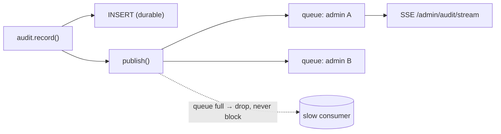

# Architecture Deep-Dive

`DESIGN.md` answers *what* and *why*. This document goes one level down — *how it actually works*
at the level of requests, transactions, and invariants. It's the document you read before
changing the concurrency model, the audit trail, or the assignment policy.

---

## 1. Layering and dependency direction

```
HTTP endpoint  →  service (business rule)  →  crud (data access)  →  SQLAlchemy model  →  Postgres
```

Dependencies point **one way, downward**. Endpoints never contain business logic; services never
build SQL by hand for things `crud` already covers; models never import services. The payoff:
the rules that matter (assignment, state transitions, time accounting) live in small modules with
**pure, DB-free cores** that unit-test in microseconds, while the database-touching parts are
covered by integration tests against real Postgres.

| Concern | Pure core (unit-tested) | DB-bound shell (integration-tested) |
|---|---|---|
| Assignment | `choose_least_loaded(candidates)` | `pick_attorney`, `open_case_count` |
| Time accounting | `aggregate_attorney_time(periods, now)`, `compute_duration_seconds` | `attorney_time_report`, `open_period` |
| State machine | `can_transition`, `version_conflict`, `format_lead_number` | the endpoint handlers |

This split is deliberate: the logic most likely to harbor a subtle bug is exactly the logic that
runs without a database, so it gets the fastest, most exhaustive tests.

---

## 2. The request lifecycle and the transaction boundary

Every request runs inside **one** database session/transaction, opened and closed by a FastAPI
dependency (`get_db`):

```
get_db() yields session
   handler runs:  flush() … flush() …      ← writes are visible in-txn, not yet durable
   handler returns the response model
get_db() commits  (or rolls back on exception)
```

Two consequences the code relies on everywhere:

1. **Handlers `flush()`, they don't `commit()`.** A flush sends INSERT/UPDATE to Postgres so
   later statements in the same request see them (e.g., `next_lead_number` reading the max, then
   the audit row referencing the new lead id), but nothing is durable until `get_db` commits at
   the very end. If the handler raises, the whole request rolls back atomically — a lead is never
   created without its `LEAD_CREATED` audit row and `QUEUED` period.

2. **The email send happens *after* the response is built, outside the request txn.** Emails are
   fire-and-forget tasks (§6); they must never be inside the transaction or a slow SMTP call
   would hold a DB connection open.

### Why a lead create can't be half-written

The public-submit handler performs, in order: dedup lookup → `INSERT lead` → `DUPLICATE_FLAGGED`
audit (if applicable) → open `QUEUED` period → `LEAD_CREATED` audit → optional auto-assign
(`ASSIGNED` period + `AUTO_ASSIGNED` audit). All of it shares one transaction. The 201 is returned
and only *then* does `get_db` commit. Either every row lands or none does.

---

## 3. Concurrency model: optimistic locking, in detail

The dangerous operation is two attorneys acting on the same lead at once. The defense is a
`version` integer on `leads` and a compare-then-increment on every mutating write:

```
load lead (version = v)
if client_expected_version != v:  → 409 CONFLICT       # version_conflict()
mutate; version = v + 1; flush
```

- **Self-assign race.** Both attorneys load `version=3`. The first commits `version=4`; the
  second's expected `3` no longer matches → `409`. Exactly one owner, deterministically. The load
  harness drives 75 attorneys into this race and asserts the single-assignee invariant holds
  (the benchmark logged ~3000 such 409s with **zero** double-assignments).
- **Why optimistic, not `SELECT … FOR UPDATE`.** Reads vastly outnumber writes and contention
  windows are sub-millisecond; holding row locks across the handler would add latency and
  deadlock risk for no benefit. Optimistic locking gives clean, retryable `409` semantics and
  holds no locks between statements.
- **Create-time races** (two submits computing the same `lead_number`, or colliding on an
  `idempotency_key`) are caught by **unique constraints**, not version checks: the handler retries
  with a fresh number, and on idempotency collision returns the winner's receipt instead of a 500.

> **Known boundary:** `open_case_count` (capacity) is read-then-checked, not atomic with the
> assign. Under extreme contention an attorney could momentarily land at `cap+1`. It's bounded and
> self-corrects; the production hardening is a maintained counter or a partial unique index (noted
> in DESIGN §13/§3), not pessimistic locking.

---

## 4. The audit trail: append-only and live

`audit_events` is the system's spine of accountability. Two properties are enforced by *absence
of code*, not just convention:

- **No update path, no delete path.** `audit.record(...)` only ever INSERTs. Nothing in the
  codebase mutates or removes an event. (The one exception is the retention job, which deletes a
  purged lead's PII-bearing events and writes a single PII-free `CASE_PURGED` event — §7.)
- **Every state change is a row**, with `actor_kind` (`PUBLIC|ATTORNEY|ADMIN|SYSTEM`), `action`,
  and `before`/`after` JSONB snapshots, plus optional `reason` and `ip`.

### Live streaming (SSE) without a broker

`audit.record` also calls `publish()`, an in-process pub/sub: each SSE subscriber gets a bounded
`asyncio.Queue`; `publish` fans the serialized event to every queue with `put_nowait`. A slow
consumer's queue fills and **drops** rather than blocking the writer — the audit *write* is never
held hostage by a stalled browser. This is intentionally process-local: it's the right amount of
machinery for an admin dashboard, and it disappears cleanly behind a real broker (or polling) if
the API ever runs multiple replicas.



---

## 5. Time accounting: the interval model

The requirement "justify how long each attorney held each case" is impossible to answer from a
single `status` + `updated_at`. The system instead records the lead's **history of states** as
intervals in `lead_state_periods`.

**The core invariant: exactly one open period per lead.** `open_period()` is called on *every*
transition. It first closes any currently-open period for that lead (sets `exited_at = now`,
computes `duration_seconds`), then inserts a new open one. So a lead's life is a contiguous,
non-overlapping sequence of intervals:

```
QUEUED [t0→t1)   ASSIGNED(att=A) [t1→t2)   REACHED_OUT(att=A) [t2→ now)
```

`attorney_time_report` then aggregates these intervals per attorney (`aggregate_attorney_time`,
a pure function): total holding time (open ASSIGNED periods contribute *live* time up to `now`),
cases handled, average time-to-reached-out, current open load, and oldest open age. Because the
aggregator is pure and timestamp-driven, it's unit-tested deterministically by feeding synthetic
period dicts and a fixed `now`.

**Reversal** uses `previous_closed_period()` — the most recently closed interval — to restore the
*exact* prior state and assignee, with `entered_at` as a deterministic tiebreaker if two periods
ever share an `exited_at`. That's why "reverse" returns the lead to ASSIGNED-by-A, not merely to
PENDING-unassigned.

---

## 6. Notification path: isolation from the request

```
handler builds receipt
  _fire_emails(...)  →  task = asyncio.create_task(send_lead_emails(...))
                        _email_tasks.add(task); task.add_done_callback(_email_tasks.discard)
return receipt        # response goes out now
... later, on the loop: send_lead_emails runs, dispatches by EMAIL_BACKEND, never raises
```

Three deliberate details:

1. **Tracked task set.** Without holding a reference, Python may garbage-collect a bare
   `create_task` mid-flight; the `_email_tasks` set prevents that and lets the done-callback
   observe exceptions.
2. **`_send_email` is total** — it catches everything and returns a bool. A dead SMTP server or a
   bad Resend key logs and is dropped; it can never turn a successful intake into a 500.
3. **Backend is a config switch.** `console` (log), `smtp` (MailHog locally — real, viewable mail
   at `:8025`), or `resend` (HTTP API with bounded retry/backoff/timeout on transient 429/5xx).

---

## 7. Data integrity & lifecycle invariants

These hold at all times and are asserted by the load harness's invariant suite:

1. **Single assignee** — no lead is ever owned by two attorneys (concurrent assign → 409).
2. **Capacity** — no attorney exceeds `max_open_cases` (sampled; numerically exact at the boundary).
3. **Distinct leads** — every submission is its own row; dedup links, never merges.
4. **One open period per lead**; durations ≥ 0; a REACHED_OUT lead has a closed ASSIGNED period.
5. **Audit completeness** — every assign/reach-out/reverse/capacity/toggle has an event.
6. **History semantics** — phone-or-email within 6 months, excludes self, dimension toggles OR.
7. **Receipt contract** — the public response exposes only `lead_number`, `status`, `message`.
8. **Retention** — after cleanup, 0 leads older than one year; a PII-free `CASE_PURGED` remains.

### Foreign-key delete behavior (chosen per relationship)

| FK | On delete | Rationale |
|---|---|---|
| `leads.assignee_id → users` | `SET NULL` | Deleting a user must not destroy their leads. |
| `lead_state_periods.lead_id → leads` | `CASCADE` | Periods are meaningless without the lead. |
| `audit_events.lead_id → users/leads` | `SET NULL` | The audit row survives even if its subject is removed. |
| `leads.duplicate_of → leads` | `SET NULL` | Unlinking a parent must not delete the child. |

---

## 8. Performance characteristics & known costs

- **Connection pool**: `pool_size=10, max_overflow=20` (30 max). Under the 75-worker benchmark,
  concurrency can exceed 30 in-flight DB ops; excess requests queue for a connection, which is the
  primary driver of the latency *tail* (p50 ~30 ms, p95 ~1 s) — not slow queries. See the
  benchmark notes in `docs/benchmarks/`.
- **Auto-assign cost**: `pick_attorney` issues one `COUNT` per active attorney (O(N) round-trips).
  Fine at this scale; the production form is a maintained `open_count` column.
- **Queue read**: a single indexed scan of unassigned-PENDING ordered by `created_at`; trivial at
  table sizes in the thousands.
- **All correctness checks are state-based**, never timing-based, so tests are deterministic
  regardless of host speed.

---

## 9. What I would change first to scale

In priority order, none requiring a rewrite (the seams exist today):

1. **Resume storage → S3 + pre-signed URLs.** Swap the `storage` module body; the
   `save_resume`/`delete_resume` interface is unchanged. Removes local-disk statefulness — the
   single biggest blocker to running multiple API replicas.
2. **Rate limiter → shared store / WAF.** Replace the one in-memory `ratelimit` module so limits
   are global across replicas.
3. **Capacity as a maintained counter** (or partial unique index) — makes assign O(1) and closes
   the `cap+1` boundary.
4. **Queue claim via `SELECT … FOR UPDATE SKIP LOCKED`** — collapses the self-assign 409 storm
   into clean hand-offs under very high contention.
5. **Audit SSE → broker or polling** once the API is multi-replica (the pub/sub is process-local
   by design).

Everything above is configuration or a single-module swap because statelessness (JWT), pluggable
storage/email, and an isolated limiter were chosen up front.
