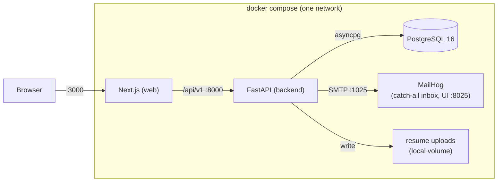
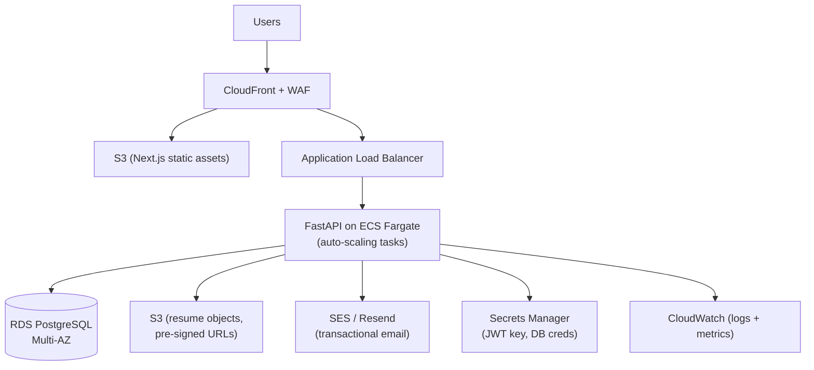
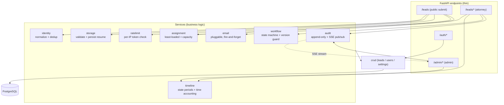
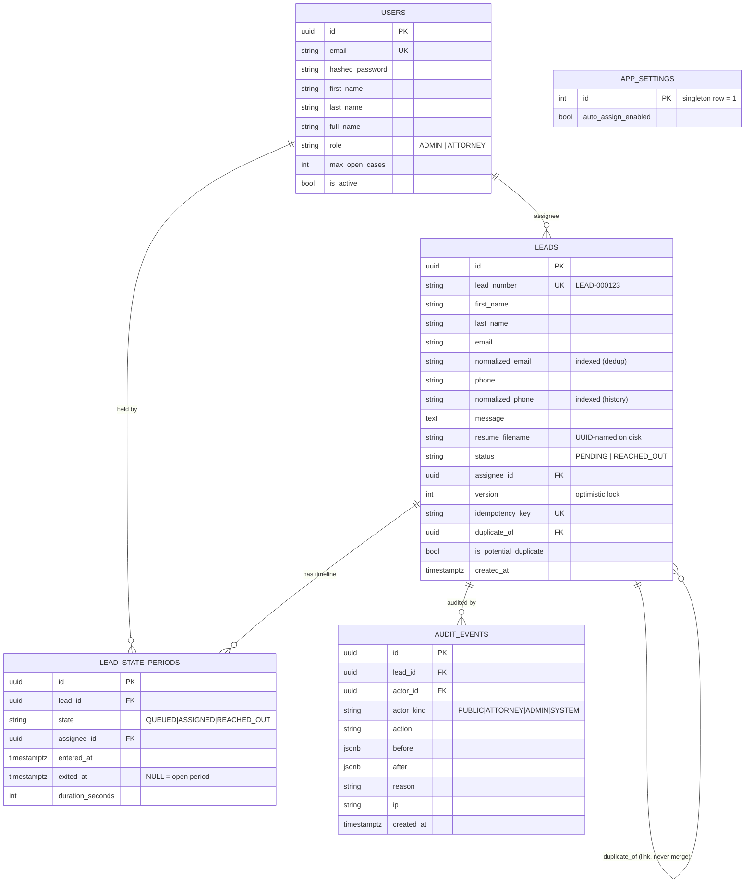
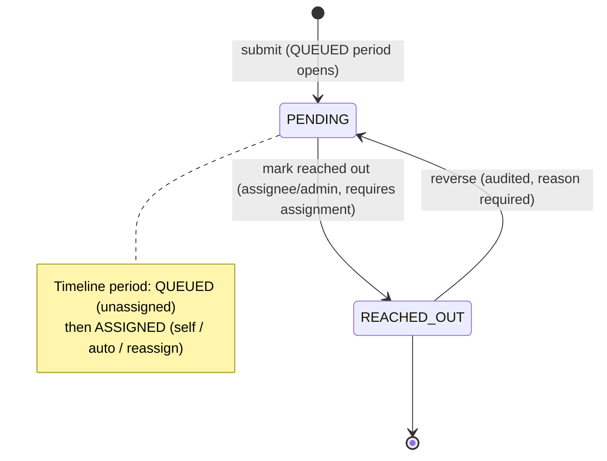
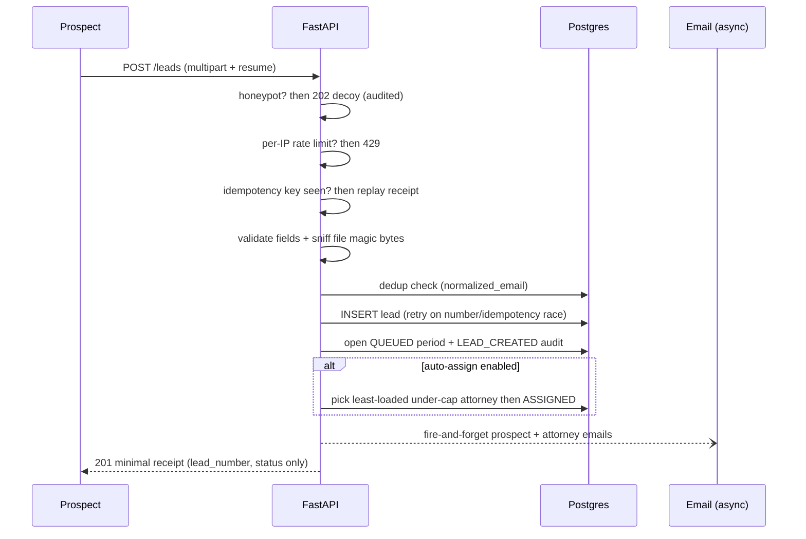
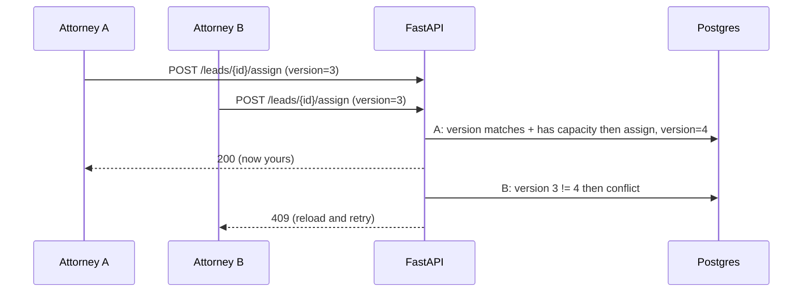
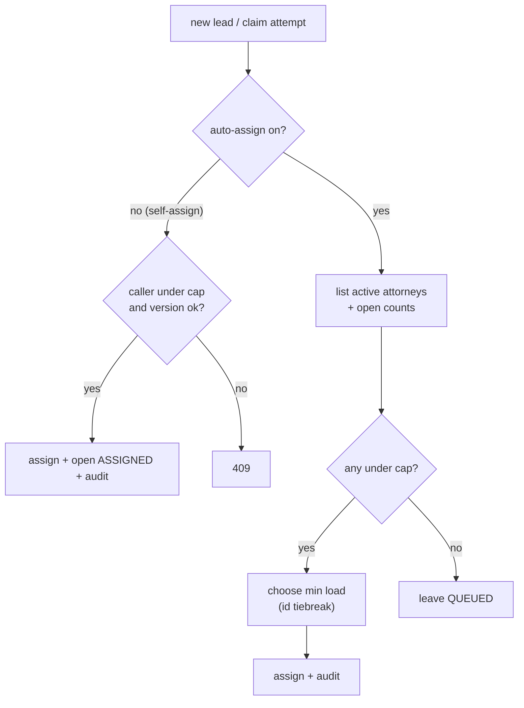
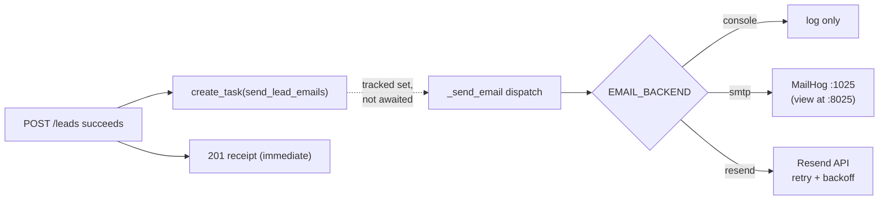

# System Design — Leads Management Platform

This document explains **what** the system is, **how** it's put together, and **why** the
key decisions were made. It's organized so a reader can go from a 30-second mental model
(the diagrams) to the reasoning behind each choice.

> Diagrams are [Mermaid](https://mermaid.js.org/) and render natively on GitHub.

---

## 1. Design principles

Three ideas drove every decision. When two pulled against each other, the one higher on this
list won.

1. **Simplicity first.** The smallest thing that fully solves the problem. One Postgres, one
   API, one web app — no message broker, no cache, no microservices for a workload this size.
   Complexity is added only when a concrete requirement demands it (e.g., interval-based time
   tracking exists because "justify attorney time" is a real requirement; a job queue does not,
   because nothing needs one yet).
2. **Correctness under concurrency.** Many attorneys act on a shared queue at once. The design
   makes the dangerous things *impossible*, not merely unlikely: optimistic locking prevents
   double-assignment and lost updates, and an append-only audit trail makes every state change
   accountable.
3. **UX = clarity, not chrome.** The interface's job is to show the *right* data at the *right*
   density. A prospect sees a single calm form. An attorney sees a FIFO queue, their own
   intakes, and one detail view that puts the timeline, case history, and related duplicates
   side by side — so a decision can be made without leaving the page. Information hierarchy over
   ornament.

---

## 2. Tech stack

| Layer | Choice | Why |
|---|---|---|
| API | **FastAPI** (Python 3.11, async) | Async I/O for concurrent attorneys; Pydantic validation and auto-generated OpenAPI/Swagger come for free. |
| Persistence | **PostgreSQL 16** | Relational integrity (FKs, unique constraints), `JSONB` for audit payloads, transactional guarantees the correctness model relies on. |
| ORM / migrations | **SQLAlchemy 2.x async + asyncpg**, **Alembic** | Typed models, explicit hand-authored migrations (no surprise autogen drift). |
| Auth | **JWT (HS256, 24h)** + **bcrypt** via passlib | Stateless tokens; no session store needed. |
| Email | **Pluggable: console / SMTP (MailHog) / Resend** | Real, viewable email locally with zero external accounts; one swap to a provider in prod. |
| Frontend | **Next.js 14 (App Router)** + **Tailwind** | Server-aware React with a small, themeable component library; Alma-inspired navy/teal tokens. |
| Local orchestration | **Docker Compose** | One command brings up the whole system, self-migrating and self-seeding. |

---

## 3. Deployment architecture — Docker today, AWS tomorrow

### Today (local / demo) — one `docker compose up`

The backend container waits for Postgres to be healthy, runs `alembic upgrade head`, seeds a
demo baseline (named users + one fully-worked example lead), then serves. No `.env`, no manual
steps.

### Tomorrow (AWS) — same shapes, managed services

The architecture is intentionally *lift-and-shift friendly*: each box above maps to a managed
AWS service with no code rewrite, only configuration.

**The migration path, by component:**

| Local | AWS | Change required |
|---|---|---|
| Postgres container | **RDS (Multi-AZ)** | `DATABASE_URL` only. |
| Local upload volume | **S3 + pre-signed URLs** | Swap the `storage` service implementation; the interface (`save_resume`/`delete_resume`) already isolates this. |
| MailHog / Resend | **SES or Resend** | `EMAIL_BACKEND` env; the email service is already pluggable. |
| In-memory rate limiter | **WAF rate rules / ElastiCache** | Replace one module (`ratelimit`) — see §11. |
| Compose | **ECS Fargate + ALB**, web on **S3/CloudFront** | Containers already built; add task defs + autoscaling. |
| Hardcoded demo secrets | **Secrets Manager** | Inject env at task start. |

The seams that make this cheap — a pluggable storage interface, a pluggable email backend, a
single isolated rate-limit module, and stateless JWT auth (no session store to externalize) —
were chosen deliberately for exactly this reason.

---

## 4. Service architecture & interactions

The backend is layered: HTTP endpoints are thin; business rules live in **services** (pure where
possible, for testability); data access lives in **crud**; the database is the source of truth.

Pure, DB-free helpers (`choose_least_loaded`, `aggregate_attorney_time`,
`compute_duration_seconds`, `can_transition`, `version_conflict`) are split out so the policy is
unit-tested in isolation, separate from integration tests that hit a real database.

---

## 5. Database architecture

**Why the schema looks like this:**

- **`version` (optimistic lock).** Every mutating write checks the client's expected version and
  increments. Two attorneys assigning the same lead → the second gets `409`, never a silent
  overwrite. Chosen over row locks because contention is short and reads vastly outnumber writes.
- **`audit_events` is append-only.** No update/delete path exists in code. It's the compliance
  spine: every assign / reach-out / reverse / capacity change / toggle is a row, with
  `before`/`after` JSONB. It also feeds the live SSE stream.
- **`lead_state_periods` (interval model).** Rather than store only the current status, each
  state the lead passes through is a row with `entered_at`/`exited_at`. Exactly one period is
  open per lead at any time. This is what makes "how long did each attorney hold each case" a
  query, not a guess — it directly answers the *justify attorney time* requirement.
- **Dedup by linkage, never merge.** A suspected duplicate gets `duplicate_of` pointing at the
  earliest match and `is_potential_duplicate = true`. Families sharing an email, or one person
  re-applying, are **never collapsed** — each submission stays a distinct, auditable case. An
  attorney can transition a whole open cluster together (see §7).
- **Normalized columns** (`normalized_email`, `normalized_phone`) are indexed and power dedup and
  case-history matching without touching the human-entered originals.

---

## 6. State machine

A lead's **status** is deliberately a simple two-state machine; the richer lifecycle lives in the
**state-period timeline** (who held it, and for how long).

- A lead is born `PENDING` with an open **QUEUED** period.
- Self-assign / auto-assign / reassign closes the current period and opens an **ASSIGNED** one.
- Marking reached out requires an assignee (so the reach-out is always attributable) and opens a
  **REACHED_OUT** period; the status transition is guarded by `can_transition` and the version.
- Reversal restores the *exact* prior state (the last closed period — usually ASSIGNED, with its
  assignee), requires a reason, and is fully audited.

---

## 7. Core flows

### Public intake (the hardened path)

The response is a **minimal receipt** — no internal fields (assignee, version, IP, dedup
linkage) ever cross the public boundary.

### Assignment under concurrency

### Related-duplicate bulk transition

From a lead's detail view, if other **open** leads share its duplicate cluster, the attorney can
select them and **assign-to-self** or **mark-reached-out** in one action. Each transition writes
an audit note referencing the **parent case number**, so the trail shows they were handled
together — without ever merging the records.

---

## 8. Lead assignment logic

Two modes share one policy:

- **Self-assign** (pull): an attorney claims from the FIFO queue. Guarded by capacity
  (`open_case_count < max_open_cases`) and the version check.
- **Auto-assign** (push): on submit, if enabled, the system picks the **least-loaded active
  attorney under capacity**; ties break deterministically by user id (round-robin friendly).
  Returns nobody if everyone is full — the lead simply stays queued.

The capacity/least-loaded decision (`choose_least_loaded`) is a **pure function** over
`(attorney_id, open_count, cap)` tuples, unit-tested independently of the database.

---

## 9. Notifications design

On every submission, **both** the prospect (confirmation) and the attorney (new-lead alert) are
emailed. The design goal: notifications must **never** affect intake success or latency, and must
be **viewable** in local dev without any external account.

- **Fire-and-forget, fault-tolerant.** Emails are dispatched as a tracked `asyncio` task after
  the response is prepared. The dispatcher **never raises** — a mail failure logs and is dropped,
  it can't 500 the intake. Task references are held so they aren't garbage-collected mid-flight.
- **MailHog for local/demo.** A real SMTP server with a web inbox — you *see* the actual emails
  at http://localhost:8025 with zero signup. Quick, basic, and honest (no mocking).
- **Resend for production**, with bounded retries, exponential backoff, and per-attempt timeouts
  for transient `429/5xx`. Swapping is one env var (`EMAIL_BACKEND`).

---

## 10. API surface + Swagger

Interactive **Swagger/OpenAPI** is auto-generated and live at **`/docs`** (ReDoc at `/redoc`).

| Method | Path | Auth | Purpose |
|---|---|---|---|
| POST | `/api/v1/leads` | public | Submit a lead (multipart) → minimal receipt |
| GET | `/api/v1/leads` | staff | Paginated list |
| GET | `/api/v1/leads/queue` | staff | Unassigned PENDING (FIFO) |
| GET | `/api/v1/leads/my-cases` | staff | Caller's open assigned leads |
| GET | `/api/v1/leads/by-number/{n}` | staff | Lookup by `LEAD-…` number |
| GET | `/api/v1/leads/{id}` | staff | Detail + timeline |
| GET | `/api/v1/leads/{id}/resume` | staff | Download resume (token-gated, PII) |
| GET | `/api/v1/leads/{id}/history` | staff | Prior cases (phone/email/name, 6mo) |
| GET | `/api/v1/leads/{id}/related` | staff | Open leads in the duplicate cluster |
| POST | `/api/v1/leads/{id}/related/transition` | staff | Bulk assign / reach-out related leads |
| POST | `/api/v1/leads/{id}/assign` | staff | Self-assign |
| POST | `/api/v1/leads/{id}/reassign` | staff | Reassign / unassign |
| PATCH | `/api/v1/leads/{id}/status` | staff | Mark REACHED_OUT |
| POST | `/api/v1/leads/{id}/reverse` | staff | Reverse (reason required) |
| POST | `/api/v1/auth/login` | public | Get JWT |
| GET | `/api/v1/auth/me` | staff | Current user |
| GET | `/api/v1/admin/attorneys` | admin | Capacity + current load |
| PUT | `/api/v1/admin/attorneys/{id}/capacity` | admin | Set max open cases |
| PUT | `/api/v1/admin/settings/auto-assign` | admin | Toggle auto-assign |
| GET | `/api/v1/admin/audit` | admin | Recent audit events |
| GET | `/api/v1/admin/audit/stream` | admin | **Live audit (SSE)** |
| GET | `/api/v1/admin/metrics` | admin | Operational dashboard metrics |
| GET | `/api/v1/admin/attorney-time` | admin | Per-attorney time accounting |
| GET | `/health` | public | Health check |

---

## 11. Security & hardening

- **Public boundary**: honeypot field, per-IP rate limiting, idempotency keys, streaming
  upload-size cap (no full-file buffering → no memory-exhaustion DoS), and **content-based file
  validation** (PDF/DOC/DOCX verified by magic bytes, not the client-supplied MIME/extension).
- **No data leakage**: the public submit returns only a pinned minimal receipt; resumes are PII
  and served only to authenticated staff via a token, never as static files.
- **AuthZ**: role-gated endpoints; only the assignee or an admin can mutate a lead.
- **Proxy spoofing**: `X-Forwarded-For` is honored *only* when `TRUST_PROXY_HEADERS` is set, so a
  client can't mint fresh rate-limit buckets by spoofing the header.
- **Retention**: a cleanup job purges leads older than one year, removing PII while keeping a
  PII-free `CASE_PURGED` audit row.

> **Known prototype tradeoff:** the rate limiter is in-memory (per-process). It's deliberately
> isolated in one module so production swaps it for WAF rules or a shared store — see §3.

---

## 12. UX design

- **One job per screen.** Prospect: a single form. Attorney: queue → my intakes → one detail
  view. Admin: one operational dashboard.
- **Decisions without navigation.** The lead detail page co-locates the timeline, 6-month case
  history (toggle match dimensions), and related open duplicates — the attorney sees everything
  needed to act in one place.
- **Live, not stale.** The admin audit streams over SSE; the queue and metrics reflect ground
  truth, so "what's happening right now" is never a guess.
- **Identity is explicit.** The navbar shows the signed-in attorney's name and labels their
  workspace "<Name>'s Intakes" — small touches that make a shared tool feel personal.
- **Coherent visual language.** A small Tailwind token set (Alma-inspired navy/teal) and a shared
  component library keep every surface consistent.

---

## 13. Why / how — decisions at a glance

| Decision | Alternative considered | Why this won |
|---|---|---|
| Optimistic locking (`version`) | Pessimistic row locks | Reads ≫ writes; short contention; no held locks, clean 409 semantics. |
| Append-only audit + interval periods | A single `status` column + `updated_at` | Only this can *prove* who did what and *justify time*; compliance-grade. |
| Link-and-flag dedup | Merge duplicates | Merging destroys records and mishandles families; linking keeps every case auditable. |
| Pluggable email + MailHog | Mock email in tests / Resend-only | Real, viewable mail locally; one-env swap to prod; intake never blocked. |
| FastAPI + one Postgres | Microservices / broker / cache | Simplicity-first; the workload doesn't justify the operational cost. |
| Stateless JWT | Server sessions | Nothing to externalize when scaling to multiple tasks. |
| Pure policy functions | Logic inside endpoints | Fast, deterministic unit tests for the rules that matter most. |

---

## 14. Verification

The system is proven, not asserted: a unit + integration suite (state-based invariants, not
timing-dependent) plus a **repeatable load/benchmark recipe** (`backend/tests/load/`) that drives
1000 leads / 75 attorneys through every flow and asserts correctness invariants, with a
clean-state teardown that never deletes real data and an error-rate gate. The latest curated run
is in [`docs/benchmarks/`](docs/benchmarks/): **0% error rate, 0×5xx, all invariants held.**
